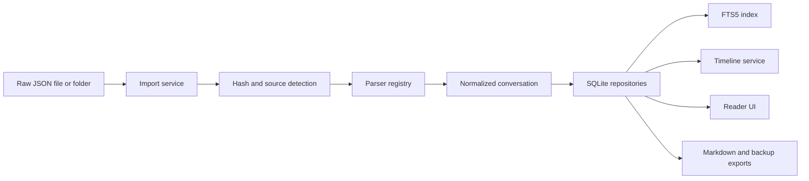

# Architecture

Claude Chat Archive Viewer is split into layers that can evolve independently.

## Layers

1. **UI**: Next.js app router, React components, shadcn-style primitives, Framer Motion.
2. **Application services**: import orchestration, search, timeline, markdown export, backup, settings, AI organization contracts.
3. **Domain**: normalized conversation, message, code block, tool call, link, file, tag, and date models.
4. **Parser layer**: source-specific parsers for Claude Code, OpenAI exports, and generic chat JSON.
5. **Persistence**: SQLite repositories and migrations.
6. **Desktop shell**: Tauri wrapper for local file access and future native menus.

## Data Flow

## Separation Rules

- Parsers do not write to the database.
- Repositories do not parse source formats.
- UI components do not read raw JSON directly.
- Export services read normalized models, not parser-specific payloads.
- AI features depend on normalized data and are opt-in.

## Extensibility

Future parser plugins should implement `ArchiveParser` and register through `ParserRegistry`. Future search providers should implement the `SearchProvider` interface without replacing repository contracts.

